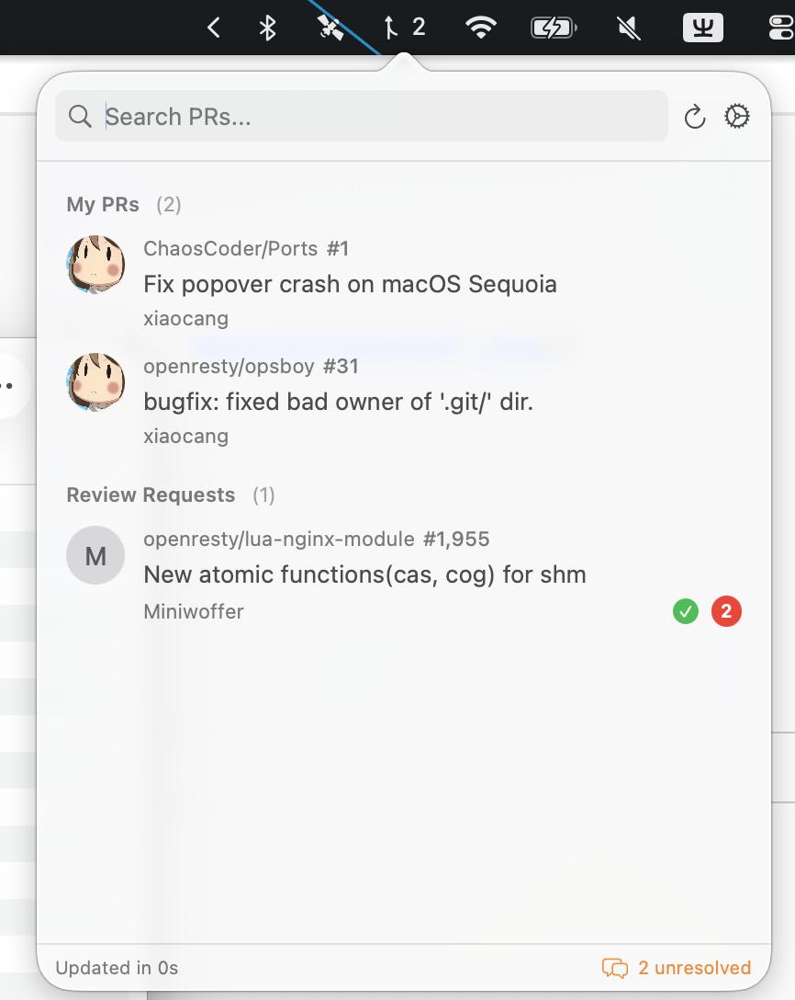

# PR Dashboard

A lightweight macOS menu bar app for tracking your GitHub pull requests and review requests.




## Features

- **Menu Bar App** - Lives in your menu bar, no dock icon clutter
- **PR Overview** - View your authored PRs and review requests in one place
- **CI Status** - See CI check status (success/failure/pending) for each PR
- **Unresolved Comments** - Badge shows total unresolved comment count
- **Secure Authentication** - GitHub Device Flow or Personal Access Token (PAT)
- **Auto-Refresh** - Configurable refresh interval (1min - 30min), runs in background for notifications
- **Notifications** - Desktop alerts for new unresolved comments and CI status changes
- **Battery Friendly** - Auto-pauses background refresh in Low Power Mode or on cellular/hotspot
- **Search** - Filter PRs by title, repo, or author
- **Quick Actions** - Click to open PR in browser, copy URL

## Installation

### Homebrew (Recommended)

```bash
brew install xiaocang/tap/prdashboard
```

### Manual Download

1. Download the latest release from [Releases](https://github.com/xiaocang/ghpr-view/releases)
2. Extract the ZIP file
3. Move `PRDashboard.app` to your Applications folder
4. Open the app (you may need to right-click → Open the first time)

## Usage

### Option 1: GitHub Device Flow (Recommended)

1. Click the menu bar icon to open the dashboard
2. Click "Sign in with GitHub"
3. Enter the displayed code at github.com/login/device
4. Once authorized, your PRs will load automatically

### Option 2: Personal Access Token (PAT)

1. Create a [Personal Access Token](https://github.com/settings/tokens) with `repo` scope
2. Click the menu bar icon to open the dashboard
3. Click "Sign in with GitHub", then "Use Personal Access Token"
4. Paste your token and click "Sign In"

### Controls

- **Left-click** menu bar icon - Open PR dashboard
- **Right-click** menu bar icon - Show context menu (Quit)
- **Cmd+R** - Refresh PR list
- **Settings** (gear icon) - Configure refresh interval, filters, notifications

### Settings

- **Refresh Interval** - How often to fetch updates (1min to 30min)
- **Refresh on Open** - Refresh immediately when opening the popover
- **Repositories** - Filter to specific repos, case-insensitive (e.g., `owner/repo` or `owner/` for all repos)
- **Show Drafts** - Include/exclude draft PRs
- **CI Status Exclude Filter** - Exclude status checks by keyword (e.g., "review")
- **Notifications** - Enable/disable desktop notifications for new unresolved comments
- **Pause in Low Power Mode** - Pause background refresh when macOS Low Power Mode is active
- **Pause on Cellular/Hotspot** - Pause background refresh on expensive networks (iPhone hotspot, etc.)

## Requirements

- macOS 13.0 or later
- GitHub account

## Building from Source

```bash
git clone https://github.com/xiaocang/ghpr-view.git
cd ghpr-view
./run.sh
```

## License

MIT License - See [LICENSE](LICENSE) for details.

## Contributing

Contributions are welcome! Please open an issue or submit a pull request.
